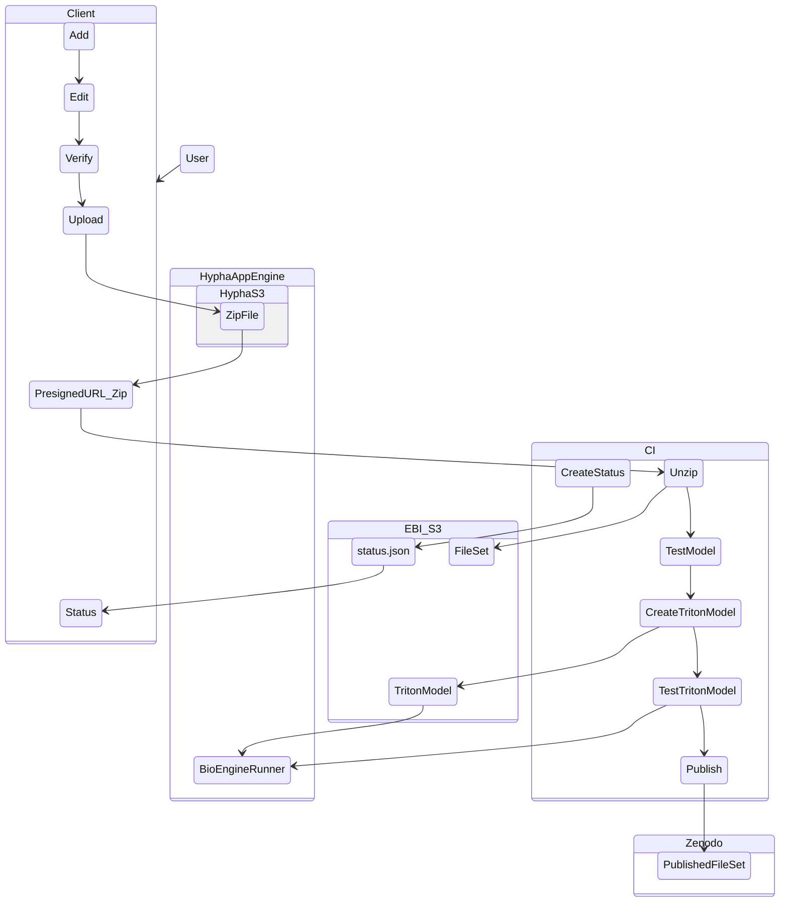

# Uploader Overview




## Developing

Start a development server:

```bash
ntl dev

# or run without netlify functions: 
npm run dev 
```

## Building

To create a production version of the app:

```bash
npm run build
```
